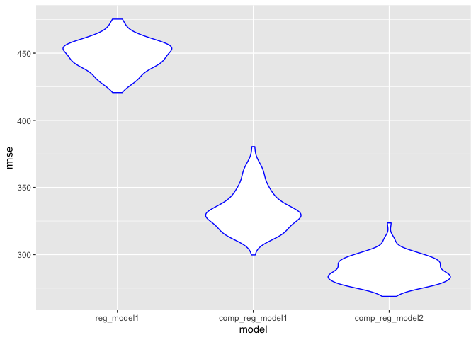

p8105\_hw6\_blm2156
================
Britney Mazzetta

``` r
library(tidyverse)
```

    ## ── Attaching packages ───────────────────────────────── tidyverse 1.2.1 ──

    ## ✔ ggplot2 3.2.1     ✔ purrr   0.3.2
    ## ✔ tibble  2.1.3     ✔ dplyr   0.8.3
    ## ✔ tidyr   1.0.0     ✔ stringr 1.4.0
    ## ✔ readr   1.3.1     ✔ forcats 0.4.0

    ## ── Conflicts ──────────────────────────────────── tidyverse_conflicts() ──
    ## ✖ dplyr::filter() masks stats::filter()
    ## ✖ dplyr::lag()    masks stats::lag()

``` r
library(modelr)
```

# Problem 1

``` r
btw = read_csv("./data/birthweight.csv") %>%
  janitor::clean_names() %>%
  mutate(
    babysex = factor(babysex, levels = c(1,2), labels = c("male", "female")),
    frace = factor(frace, levels = c(1,2,3,4,8,9), labels = c("white", "black", "asian", "puerto rican", "other", "unknown")),
    malform = factor(malform, levels = c(0,1), labels = c("absent", "present")),
    mrace = factor(mrace, levels = c(1,2,3,4,8,9), labels = c("white", "black", "asian", "puerto rican", "other", "unknown")
  ))
```

    ## Parsed with column specification:
    ## cols(
    ##   .default = col_double()
    ## )

    ## See spec(...) for full column specifications.

``` r
btw
```

    ## # A tibble: 4,342 x 20
    ##    babysex bhead blength   bwt delwt fincome frace gaweeks malform menarche
    ##    <fct>   <dbl>   <dbl> <dbl> <dbl>   <dbl> <fct>   <dbl> <fct>      <dbl>
    ##  1 female     34      51  3629   177      35 white    39.9 absent        13
    ##  2 male       34      48  3062   156      65 black    25.9 absent        14
    ##  3 female     36      50  3345   148      85 white    39.9 absent        12
    ##  4 male       34      52  3062   157      55 white    40   absent        14
    ##  5 female     34      52  3374   156       5 white    41.6 absent        13
    ##  6 male       33      52  3374   129      55 white    40.7 absent        12
    ##  7 female     33      46  2523   126      96 black    40.3 absent        14
    ##  8 female     33      49  2778   140       5 white    37.4 absent        12
    ##  9 male       36      52  3515   146      85 white    40.3 absent        11
    ## 10 male       33      50  3459   169      75 black    40.7 absent        12
    ## # … with 4,332 more rows, and 10 more variables: mheight <dbl>,
    ## #   momage <dbl>, mrace <fct>, parity <dbl>, pnumlbw <dbl>, pnumsga <dbl>,
    ## #   ppbmi <dbl>, ppwt <dbl>, smoken <dbl>, wtgain <dbl>

## Regression Model for Birthweight

The predictors that were selected for this regression model (baby’sex,
gestational age in weeks, mother’s age at delivery, mother’s height,
parity, mother’s pre-pregnancy BMI, average number of cigarettes smoked
per day during pregnancy) were selected based on literature reviews on
child’s birthweight. This model was constructed based on more of a
hypothesized structure for the factors that underly
birthweight.

``` r
reg_model1 = lm(bwt ~ babysex + gaweeks + momage + mheight + parity + ppbmi + pnumlbw + smoken, data = btw)

reg_model1
```

    ## 
    ## Call:
    ## lm(formula = bwt ~ babysex + gaweeks + momage + mheight + parity + 
    ##     ppbmi + pnumlbw + smoken, data = btw)
    ## 
    ## Coefficients:
    ##   (Intercept)  babysexfemale        gaweeks         momage        mheight  
    ##     -2043.004        -98.906         64.749          8.794         34.221  
    ##        parity          ppbmi        pnumlbw         smoken  
    ##       121.910         15.411             NA         -7.545

## Plot of model residuals against fitted values

``` r
res_plot1 = 
btw%>%
modelr::add_residuals(reg_model1) %>%
modelr::add_predictions(reg_model1) %>%
  ggplot(aes(x = pred, y = resid)) +
  geom_point(color = "orange")
```

    ## Warning in predict.lm(model, data): prediction from a rank-deficient fit
    ## may be misleading
    
    ## Warning in predict.lm(model, data): prediction from a rank-deficient fit
    ## may be misleading

``` r
res_plot1
```

<!-- -->

## Comparison models

Predictors for this birthweight model are length at birth and
gestational age.

``` r
comp_reg_model1 = lm(bwt ~ blength + gaweeks, data = btw)

comp_reg_model1
```

    ## 
    ## Call:
    ## lm(formula = bwt ~ blength + gaweeks, data = btw)
    ## 
    ## Coefficients:
    ## (Intercept)      blength      gaweeks  
    ##    -4347.67       128.56        27.05

Predictors for this birthweight model are head circumference, length,
sex, and all interactions (including the three-way interaction) between
these
predictors.

``` r
comp_reg_model2 = lm(bwt ~ bhead + blength + babysex + bhead*blength + bhead*babysex + blength*babysex + bhead*blength*babysex, data = btw)

comp_reg_model2
```

    ## 
    ## Call:
    ## lm(formula = bwt ~ bhead + blength + babysex + bhead * blength + 
    ##     bhead * babysex + blength * babysex + bhead * blength * babysex, 
    ##     data = btw)
    ## 
    ## Coefficients:
    ##                 (Intercept)                        bhead  
    ##                  -7176.8170                     181.7956  
    ##                     blength                babysexfemale  
    ##                    102.1269                    6374.8684  
    ##               bhead:blength          bhead:babysexfemale  
    ##                     -0.5536                    -198.3932  
    ##       blength:babysexfemale  bhead:blength:babysexfemale  
    ##                   -123.7729                       3.8781

\#\#Cross Validation Prediction Error

``` r
cv_bwt = crossv_mc(btw, 100)

cv_bwt = 
  cv_bwt %>%
  mutate(reg_model1 = map(train, ~lm(bwt ~ babysex + gaweeks + momage + mheight + parity + ppbmi + pnumlbw + smoken, data = .x)),
  comp_reg_model1 = map(train, ~lm(bwt ~ blength + gaweeks, data = .x)),
  comp_reg_model2 = map(train, ~lm(bwt ~ bhead + blength + babysex + bhead*blength + bhead*babysex + blength*babysex + bhead*blength*babysex, data = .x))
  ) %>%
  mutate(rmse_reg_model1 = map2_dbl(reg_model1, test, ~rmse(model = .x, data = .y)),
  rmse_comp_reg_model1 = map2_dbl(comp_reg_model1, test, ~rmse(model = .x, data = .y)),
  rmse_comp_reg_model2 = map2_dbl(comp_reg_model2, test, ~rmse(model = .x, data = .y)))

cv_bwt %>%
  select(starts_with("rmse")) %>%
  pivot_longer(
    everything(),
    names_to = "model",
    values_to = "rmse",
    names_prefix = "rmse_") %>% 
  mutate(model = fct_inorder(model)) %>% 
  ggplot(aes(x = model, y = rmse)) + geom_violin(color = "blue")
```

<!-- -->

# Problem 2

``` r
weather_df = 
  rnoaa::meteo_pull_monitors(
    c("USW00094728"),
    var = c("PRCP", "TMIN", "TMAX"), 
    date_min = "2017-01-01",
    date_max = "2017-12-31") %>%
  mutate(
    name = recode(id, USW00094728 = "CentralPark_NY"),
    tmin = tmin / 10,
    tmax = tmax / 10) %>%
  select(name, id, everything())
```

    ## Registered S3 method overwritten by 'crul':
    ##   method                 from
    ##   as.character.form_file httr

    ## Registered S3 method overwritten by 'hoardr':
    ##   method           from
    ##   print.cache_info httr

    ## file path:          /Users/britneymazzetta/Library/Caches/rnoaa/ghcnd/USW00094728.dly

    ## file last updated:  2019-10-01 10:03:04

    ## file min/max dates: 1869-01-01 / 2019-09-30

## Bootstrap

``` r
set.seed(3)

fcn_boots = function(df) {
  sample_frac(df, size = 0.5, replace = TRUE)
}


boot_straps = 
  tibble(
    strap_number = 1:5000,
    strap_sample = rerun(5000, fcn_boots(weather_df))
  )

boot_straps
```

    ## # A tibble: 5,000 x 2
    ##    strap_number strap_sample      
    ##           <int> <list>            
    ##  1            1 <tibble [182 × 6]>
    ##  2            2 <tibble [182 × 6]>
    ##  3            3 <tibble [182 × 6]>
    ##  4            4 <tibble [182 × 6]>
    ##  5            5 <tibble [182 × 6]>
    ##  6            6 <tibble [182 × 6]>
    ##  7            7 <tibble [182 × 6]>
    ##  8            8 <tibble [182 × 6]>
    ##  9            9 <tibble [182 × 6]>
    ## 10           10 <tibble [182 × 6]>
    ## # … with 4,990 more rows

## Analyzing Bootstrap Samples - lnb0\*b1

``` r
bootstrap_results = 
  boot_straps %>% 
  mutate(
    models = map(strap_sample, ~lm(tmax ~ tmin, data = .x)),
    results = map(models, broom::tidy)) %>% 
  unnest(cols = c(results)) %>%
  select(strap_number, term, estimate) %>% 
  pivot_wider(names_from = term, values_from = estimate) %>%
  janitor::clean_names() %>% 
    rename(b0 = intercept, b1 = tmin) %>%
     mutate(ln_b0b1 = log(b0*b1)) %>%
  select(-b0, -b1)
```

## Analyzing Bootstrap Samples - r^2

``` r
bootstrap_results2 = 
  boot_straps %>%
  mutate(
    models= map(strap_sample, ~lm(tmax~tmin, data = .x)), 
    results = map(models, broom::glance)) %>%
  select(-strap_sample, -models) %>%
  unnest(cols = c(results)) %>%
  select(strap_number, r.squared)
```

## Plot of betas and r^2

``` r
plot1 = bootstrap_results %>%
  ggplot(aes(x = ln_b0b1)) +
  geom_density(color = "purple")

plot1
```

<!-- -->
The plot of the log of b0\*b1 against density appears approximately
normal. Therefore, we can infer that the 95% confidence interval is
about (1.925, 2.075)

``` r
plot2 = bootstrap_results2 %>%
  ggplot(aes(x = r.squared)) +
  geom_density(color = "purple")

plot2
```

<!-- -->

The plot of the R2 against the density is approximately normal.
Therefore, we can infer that the confidence interval is about (0.8875,
0.9375).
